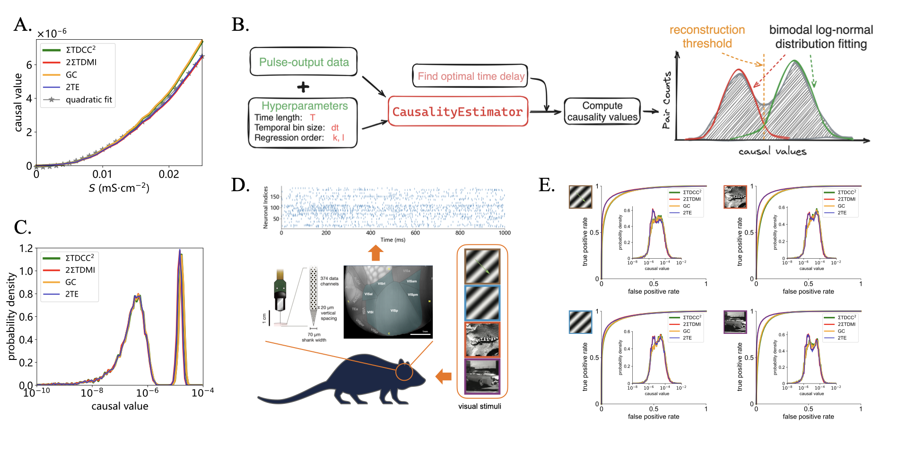
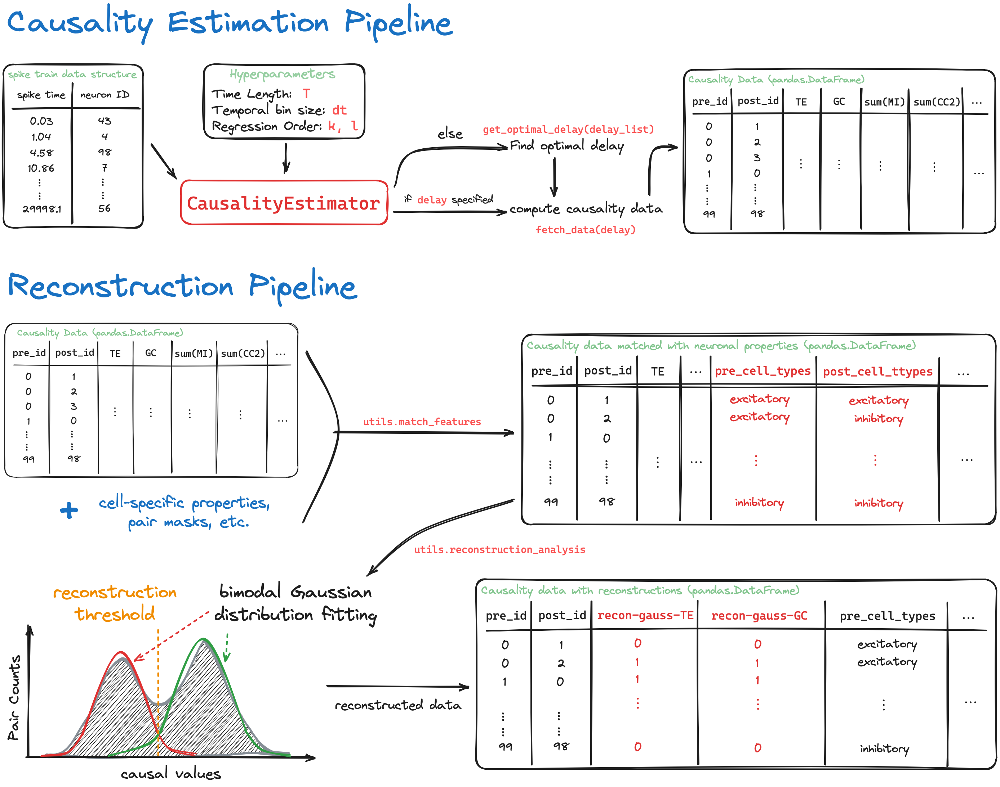

# Causal connectivity measures for pulse-output network reconstruction

Code for paper [**Causal connectivity measures for pulse-output network reconstruction: Analysis and applications**](https://www.pnas.org/doi/10.1073/pnas.2305297121#supplementary-materials).



## Requirements

### C/C++ Dependencies

- [`Eigen`](https://eigen.tuxfamily.org): library of vector/matrix operation

  ```bash
  # Install on Ubuntu
  sudo apt-get update
  sudo apt-get install libeigen3-dev
  ```
- [`boost`](http://www.boost.org/users/download/): containing library used for argparsers.

  ```bash
  # Install on Ubuntu
  sudo apt-get install libboost-all-dev
  ```

### Python

- network simulation: numpy, brian2
- network reconstruction: numpy, pandas matplotlib, scipy, sci-kit learn, seaborn, 

## Installation

### Compile C/C++ modules

```bash
make all -j
```

### Install Python utilities

```bash
conda create -n causal4 python=3.11 --file requirements.txt -c conda-forge
conda activate causal4
pip install -e .
```

Install additional packages for running large E-I balanced network simulation:
```bash
pip install --upgrade "jax[cpu]"
pip install -U brainpy
pip install brainpylib
pip install -U "ray[default]"
```

## causal4reconstruction pipelines



## Usage

## spike-train data structure

The spike-train data should be stored in a binary data file structured as the schematics above. You can create the data structure using numpy.ndarray and save it to a binary file using utility function: `causal4.utils.save2bin`. Check the example below:

```python
import numpy as np
from causal4.utils import save2bin

# create spike data for demo
spike_times = np.array([0.1, 0.4, 0.8, 1, 1.4])
spike_ids = np.array([0, 1, 3, 2, 0])
spike_data = np.vstack([spike_times, spike_ids]).T
# now spike_data is a (5, 2) shaped array, where the first column is spike times and the second column is the corresponding neuron id.

# save the spike data to a binary file
filename = './test/data_example'
save2bin(filename+'_spike_train.dat', spike_data)

# note that the filename should not contain the extension '.dat', and the full filename must ended up with '_spike_train.dat'.

```


## Example

```python
import numpy as np
import seaborn as sns
from causal4.Causality import CausalityEstimator
from pathlib import Path

# Initialize the CausalityEstimator
estimator = CausalityEstimator(
    path='./test/', spk_fname='data_example', N=100, T=1e7, n_thread=60)
# specify hyperparameters in the initialization, including T, dt and order parameter (k, l).

# Causality Estimation
# ====================

# Fetch the causality data as a pandas dataframe
data = estimator.fetch_data(new_run=True)
# new_run=True will run the causality estimation if the data is not available
data.head()

# Search of optimal delay parameter
optimal_m = estimator.get_optimal_delay(np.arange(10)*0.5)

# Plot distribution of TE values in log-scale
sns.histplot(np.log10(data['TE']), kde=True, bins=100)

# Reconstruction analysis
# ====================

from causal4.utils import match_features, reconstruction_analysis
from causal4.myplot import reconstruction_illustration

# align causality measures with ground truth and other neuronal properties, such as cell-types
data_matched = match_features(data, N=100, conn_file='./test/connect_matrix.dat')
# reconstruction analysis
data_recon, fig_data = reconstruction_analysis(data_matched, nbins=100)
# plot reconstruction distributions
fig = reconstruction_illustration(fig_data)

```


## Reproduce figures in the maintext

0. Run simulation of HH10 and HH100 models:
    ```bash
    python code4data/run_HH10_scan_S.py
    python code4data/run_HH100.py
    ```
    The results will be saved in `./HH/data/EE/N=10/` and `./HH/data/EE/N=100` respectively.

1. Figure 2:
    ```bash
    python code4data/pm_scan_kl_HH10.py
    ```
2. Figure 3:
    ```bash
    python code4data/pm_scan_kl_HH10.py
    ```
3. Figure 4:
    ```bash
    python code4data/HH100_recon_pnas.py
    ```
4. Figure 5:

    To access allen data, you need to download the data using allensdk (or download directly from [Allen Institute](https://portal.brain-map.org/)).
    
    Install `allensdk`:
    ```bash
    pip install allensdk
    ```

    Then run the following scripts:

    ```bash
    python ./code4data/download_allen_observatory_data.py # download data
    python ./code4data/extract_allen_data_pkl.py          # data preprocessing
    python ./code4data/allen_data_causality_estimation.py
    python ./code4data/test_allen.py
    ```